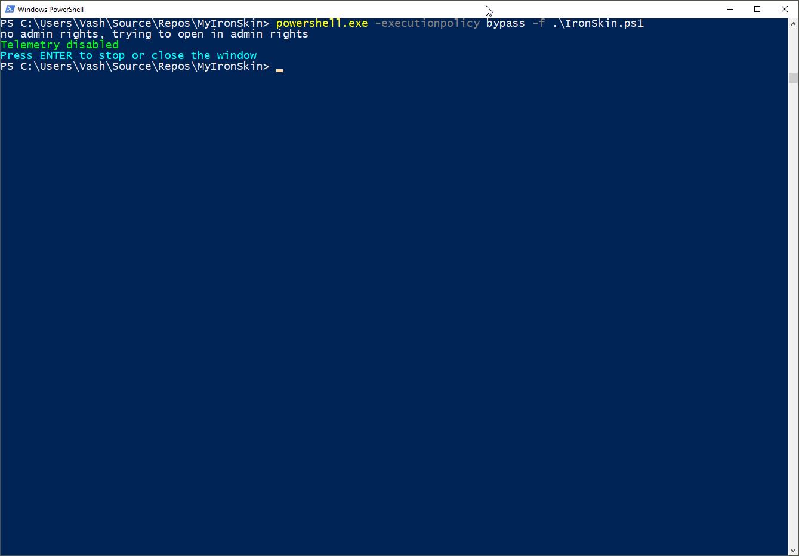

# MyIronSkin
Common settings I apply on my windows machines.



## Motivation

Everytime I install a new machine, I want to iron the settings out. But I forget what I apply, so I create this script to not forget and practice some PowerShell.

## Build status

No CI yet.


## Code style

I try to adapt this style found at [Stackoverflow](https://stackoverflow.com/a/2031927/426662)

## Built with

* PowerShell

## Features

* Disables Windows Telemetry

## Tests

There are no tests yet, but I plan to use Pester.

## How to use?

```powershell
powershell.exe -ExecutionPolicy bypass -f .\IronSkin.ps1
```

I'd love to hear ideas what else should be added to the script. Just add an issue and let us discuss.

## Credits

I built this myself, anyone contributing will be listed here :)

## License

GNU GPL v3 © Vash